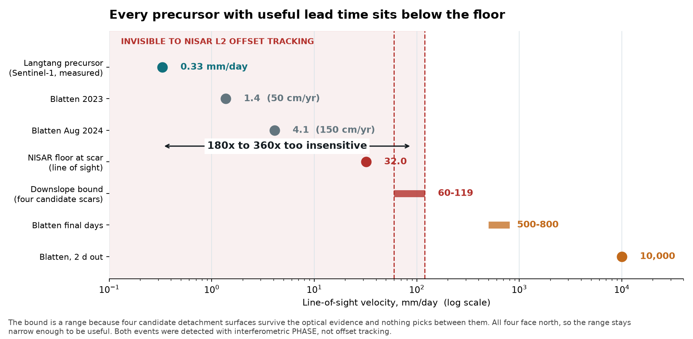
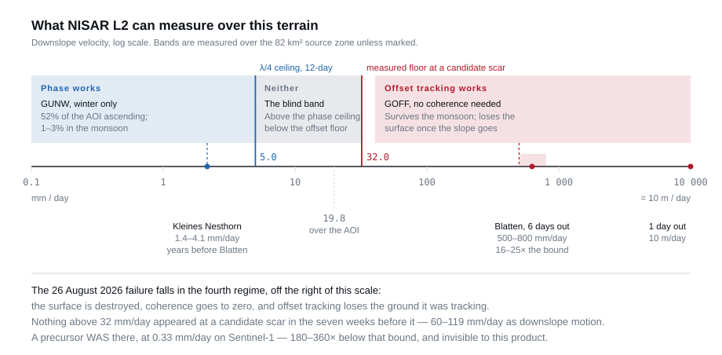
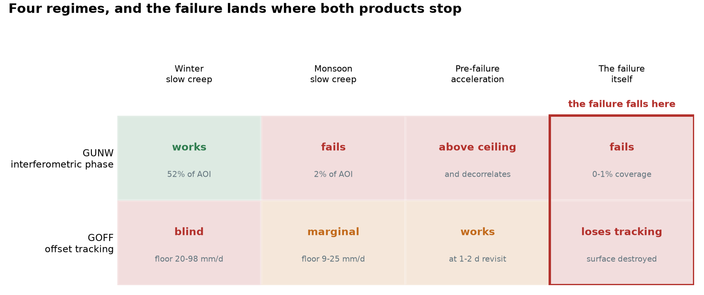
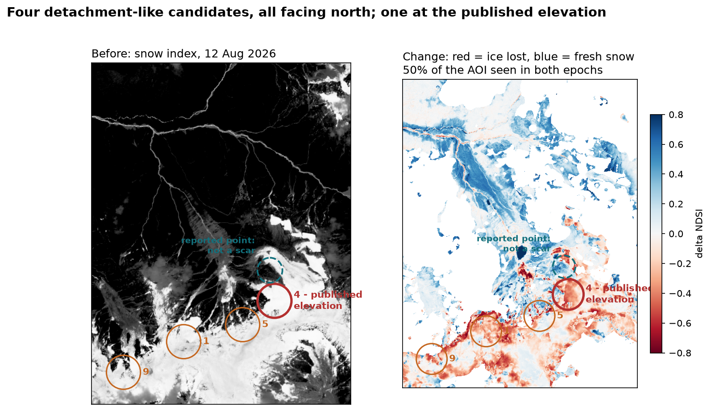

# SARGuardian

**How much warning could NISAR have given before the Langtang collapse?**
We measured the answer instead of assuming it: **none, and we can say by how
much.** Built on NASA NISAR L-band products, tested against the 26 August 2026
Langtang Lirung failure that killed more than a thousand people.



On 26 August 2026 a rock and ice face detached from Langtang Lirung, fell
1,200 m, dammed the Lhende Khola and burst. We had sixteen NISAR L2 products
over that slope.

A precursor **did** exist: Sentinel-1 interferometry measured the slope
creeping at about **0.33 mm/day**, accelerating over the final weeks. Our
measured detection floor is **32 mm/day** in line of sight and **60-119 mm/day**
as downslope motion, depending on which of four candidate detachment surfaces
is the real one - none of which is where the reports put it.

**NISAR L2 offset tracking at 12-day repeat was 180x to 360x too insensitive
to see the signal that was there.** That gap is the result. It is not "nothing was
happening"; it is a measured requirement, and it names the fix: precursor
detection here needs interferometric *phase*, not offset tracking, and two
orders of magnitude more sensitivity.

### See it in thirty seconds

```bash
git clone https://github.com/moshiour0/SARGuardian.git && cd SARGuardian
pip install -r requirements.txt
python demo.py
```

No credentials, no downloads, no 51 GB archive. Every number it prints is
computed live from committed measurements. Then:

```bash
python -m pytest tests/ -q     # 149 tests
python tests/mutate.py         # 56 historical bugs reintroduced; all must be caught
```

| | |
|---|---|
| **Where it failed** | [mapped from Sentinel-2](#mapping-the-scar-from-optical-imagery) - and the assumed point was wrong |
| **What we could see** | [the floor at the point](#the-bound-at-the-point-not-over-the-area), with intervals |
| **Why phase, not offsets** | [the four regimes](#the-four-regimes) |
| **Reproduce every number** | [REPRODUCE_RESULTS.md](REPRODUCE_RESULTS.md) |
| **What is still wrong** | [known limitations](#known-limitations) |

---

## The finding

We set out to detect a Himalayan slope failure with NISAR. We could not, and
the reason is the result.

**Spaceborne L-band SAR has four regimes over this terrain, and the failure
falls in the one where both products stop working.** Interferometric phase
measures slow creep and only in winter: over the source zone it holds **52% of
the AOI on ascending in winter and 2% in the monsoon**. Offset tracking survives
the monsoon but its 3-sigma floor is 19.8 mm/day over the AOI and worse at a
point, hundreds of times faster than the creep that precedes a failure like
this. When the slope actually goes, the surface is destroyed, correlation
collapses, and offset tracking loses the ground it was tracking - which is
itself the only signal either product records of the event.

So the answer to "can NISAR L2 give warning of a collapse like this one" is no,
and we can say precisely which limit stopped each product.

### The precursor was there. We could not have seen it.

This page used to end that paragraph with *"It was not there."* **That was
wrong, and it is the most important correction in this repository.**

Precursory motion at Langtang Lirung **was** detected - by someone else, with a
different instrument, after the event. Manoochehr Shirzaei (Virginia Tech)
measured the glacier-rock system creeping at roughly **10 mm/month, about 0.33
mm/day**, from Sentinel-1 interferometry spanning 8 January to 18 August 2026,
with part of the slope accelerating over the final weeks. The researchers are
explicit that this is hindsight and not a forecast: the acceleration "could not
show whether a failure was imminent", and the pattern became legible only after
the collapse.

Set that against what this project measured:

| | mm/day |
|---|---|
| Precursory creep, measured by Sentinel-1 phase | **0.33** |
| NISAR GOFF 3-sigma floor, AOI median, ascending | 19.8 |
| NISAR GOFF 3-sigma floor, at a candidate scar | 32.0 |
| Same floor as a bound on **downslope** motion, across four candidate scars | **60 - 119** |

The precursor sits **two to three orders of magnitude below** anything this
product could resolve. So the null was real, the bound was sound, and the
conclusion is unchanged - but the correct statement is not "nothing was
happening". It is:

> **A precursor existed at ~0.33 mm/day. Our floor is 32.0 mm/day in line of
> sight, and 60 to 119 mm/day expressed as downslope motion once look geometry
> is accounted for - a range, because four candidate detachment surfaces
> survive the evidence and we cannot pick between them. NISAR L2 offset
> tracking at 12-day repeat was therefore 180x to 360x too insensitive to see
> the signal that was there, whichever candidate is the scar. The gap is the
> result.**

That is a stronger claim than the one it replaces, because it is a measured
requirement rather than an absence, and because an independent instrument
supplies the ground truth. It also names the fix: the detection was made with
**phase**, not offsets, and this project reached for offsets partly because a
coverage bug made winter phase look like a 3% scrap when it is more than half
the AOI. See [the coverage correction](#product-coverage).

**A Blatten-class precursor would not have saved us either.** The comparison
this page used to draw - 0.5-0.8 m/day at six days out, which clears the floor
by 12-20x - uses only the *final days* of that event. Blatten's usable-lead-time
precursor was 50 cm/yr in 2023 rising past 150 cm/yr in August 2024, which is
**1.4-4.1 mm/day**, and it too was found with L-band phase. That is 10-30x
*below* our floor. Both events say the same thing: offset tracking is the wrong
instrument for precursor detection, and the useful signal lives in phase.

That bound is the **worst** of the three intervals covering those seven weeks
(40.4, 19.2 and 34.3 mm/day at the failure point), because a bound that holds
across a window is set by its weakest interval. An earlier version quoted 33.4
mm/day, which is the median across all eight ascending pairs - five of them
winter pairs from November to January, outside the window being bounded. That
is the same pooling error this page diagnoses in the seasonal noise claim,
committed on the headline number.

That floor is measured **at the failure point**, not over the area. Over the
whole 82 km2 source polygon the same products give 18.6 mm/day, and quoting
that number here would overstate what NISAR could see on the hillside that
failed. See [the bound at the point](#the-bound-at-the-point-not-over-the-area).

### The failure point was a guess, and it was wrong. Here is the measured one.

`28.28771 N 85.52809 E` was estimated from the reported location, never derived
from data. It has now been tested against Sentinel-2 and **it is not a scar** -
121 usable pixels, no cloud, and its snow index went UP. See
[mapping the scar](#mapping-the-scar-from-optical-imagery).

What replaced it is **not one location**. Four clusters survive as
detachment-like, and nothing in the data picks between them. But all four lie
**within 13 degrees of north**, so the west-facing assumption fails whichever is
the scar, and the bound weakens from 36 to **60-119 mm/day**. The reasoning
below still holds; only the input was wrong:

**The aspect costs the bound a factor of three.** Its elevation (5,166 m) is
close to the ~5,200 m detachment in the published accounts. But every published
description puts the scar on the **north face** of Langtang Lirung, and SRTM at
that pixel reads **west-facing**.

That is not a stencil artefact. Aspect there is 268-279 degrees at every DEM
stencil from 60 m to 300 m. The pixel is robustly west-facing, so it is
probably not on the surface that failed. Searching the surrounding 2 km, the
nearest terrain that matches the published description - steep, north-facing,
at the right elevation - is about **550 m south**, at 28.27771 N 85.52809 E:
5,374 m, slope 39.8 degrees, aspect 351 degrees.

Aspect decides every sensitivity number in this repository, because sensitivity
is a dot product with the downslope vector. Run it three ways
(`geometry_merge.py --sensitivity --aspect ...`, which exists so this can be
tested rather than asserted):

| Failing surface | NISAR ASC 098 sensitivity | LOS floor -> downslope bound |
|---|---|---|
| West-facing, 273 deg (assumed point, as SRTM reads it) | -0.892, usable | 32.0 -> **36 mm/day** |
| North-facing, 351 deg (a candidate) | -0.475, usable | 32.0 -> **67 mm/day** |
| Due north, 0 deg (published description taken literally) | **-0.283, BLIND** | 32.0 -> **113 mm/day** |

**On a due-north face both NISAR geometries fall below the 0.3 usability
threshold**, and the mission has no usable look direction at the scar at all -
only Sentinel-1 does, at -0.452. It is worth noting that the independent
detection above was made with Sentinel-1.

Neither bracket is the answer, and neither is a single figure between them.
**Four clusters survive as detachment-like** and nothing in the data picks
between them, so the bound is a range over all four:

| Candidate | km2 | Elevation | Aspect | NISAR ASC 098 | Downslope bound |
|---|---|---|---|---|---|
| 1 | 1.54 | 6,255 m | 12 deg | -0.488 | 66 mm/day |
| 4 | 0.68 | 5,370 m | 351 deg | -0.475 | 67 mm/day |
| 5 | 0.19 | 6,009 m | 347 deg | -0.533 | **60 mm/day** |
| 9 | 0.11 | 6,099 m | 9 deg | -0.268 | **119 mm/day** |

Both columns had to move, because the line-of-sight floor was also measured at
the wrong place. At a candidate scar the three intervals covering the seven
weeks before failure read **32.0, 26.0 and 7.8 mm/day**, against 40.4, 19.2 and
34.3 at the abandoned point, and on more valid pixels (71/60/60 of 169 against
49/65/26). A bound holding across a window is set by its weakest interval, so
the line-of-sight bound is **32.0 mm/day**.

So the headline bound is **60 to 119 mm/day** of downslope motion - a range,
because the location is still open. The argument was never in danger: the
precursor was 0.33 mm/day, so even the most generous candidate sits 180x above
it and the least generous 360x. **What the range does not depend on is picking
one**, and that is the point - every candidate faces north, so the west-facing
assumption fails whichever is the scar.

An earlier version of this section quoted a single **68 mm/day** from one
"measured scar" at 342 deg. That was cluster 4 alone, found because the search
was seeded next to it, and it is withdrawn - see
[mapping the scar](#mapping-the-scar-from-optical-imagery).

That is a bounded null with a measured floor behind it, paired with a measured
positive - and it is an argument about instruments and revisit, not about this
one mountain.



---

## Areas of interest

| Name | Extent | Role |
|------|--------|------|
| **Source zone** | 28.2453-28.3529 N, 85.4645-85.5562 E | **The analysis AOI.** Confirmed source zone of the 26 Aug 2026 collapse; contains the failure point at 28.28771 N, 85.52809 E. |
| Langtang | 28.2447-28.3297 N, 85.4591-85.5649 E | The wider massif box. Contains the source zone; 78.4% overlap with it. Glacier monitoring, good validation literature. |
| Lhende Khola | 28.3400-28.4700 N, 85.4400-85.6200 E | **The runout and damming corridor.** The avalanche entered this valley, blocked it, and the barrier burst. Not a control. See the correction below. |
| Blatten | 46.38-46.46 N, 7.75-7.90 E | Loetschental, Swiss Alps. Terrain-only generalisation test - see impoundment below. Not a SAR AOI. |

Select at runtime with `--aoi source`, `--aoi langtang` or `--aoi lhende`.
Both boxes are covered by NISAR paths **48 (descending)** and **98
(ascending)**.

Sentinel-1 tracks over the same ground: ASC 85 (frame 88), DESC 19 (frame 497),
DESC 121 (frames 498-499), all 12-day repeat.

### Two corrections, and the second one corrects the first

**First correction.** An earlier version carried a warning in bold: *"the
Langtang box does not contain the 26 Aug failure zone - that sits ~9 km north,
in the Lhende Khola catchment."* The **detachment** is not in the Lhende box.
It is on the north face of Langtang Lirung at about 5,200 m, inside the source
polygon, 5.8 km south of the Lhende box's southern edge. Every InSAR result
computed with `--aoi lhende` - the bounded non-detection, the detection floors,
the product-choice conclusion - was measured over ground that does not contain
the detachment. That half stands.

**Second correction, and it undoes the rest of the first.** The retraction went
on to call Lhende *"a piece of the Himalaya where nothing happened"* and demote
it to a control region. That is false. The avalanche descended into the **Lhende
Khola**, temporarily dammed it, and the barrier burst - which is the step that
turned a slope failure into a 100 km flood down the Bhotekoshi and Trishuli.
Satellite evidence for a temporary blockage in the upper Lhende Khola is in the
published accounts.

Source zone and runout are two different places, and the retraction collapsed
them into one.

**This is expensive, because it threw away the only real validation available.**
`impoundment.py` exists to map exactly this cascade - detachment, channel
blockage, breach, surge. The Lhende Khola is now a **documented landslide dam
with a documented breach**, which makes `outputs/dam_sites_lhende.geojson` a
falsifiable prediction against a real event rather than a description of
nothing. It is scored below, and it does not come out well.

So: **source zone** for where the slope failed and what SAR could see there;
**Lhende Khola** for where the channel blocked and what the terrain said about
that in advance. Both are analysis AOIs. Neither is a control.

---

## The four regimes



Measured over the source zone, on real products, except where marked.

| Regime | Velocity | GUNW - phase | GOFF - offsets | Status |
|--------|----------|--------------|----------------|--------|
| Winter, slow creep | mm/day | **Works.** 55% of the AOI ascending, below the phase ceiling | Blind. Floor 9-118 mm/day | measured |
| Monsoon, slow creep | mm/day | **Fails.** 1-3% ascending - decorrelation | Marginal. ASC floor 9-25 mm/day | measured |
| Pre-failure acceleration | m/day | Fails. Above the ceiling, and decorrelates | Works at 1-2 day revisit | simulated |
| **The failure itself** | metres | **Fails.** 0-1% coverage | **Loses the surface it tracks** | **measured** |

The two products have **opposite** seasonal behaviour, which is the physically
sensible answer and not the one we expected. Offsets track amplitude speckle
and improve modestly in the monsoon; phase needs coherence and collapses in it.

---

## Why NISAR L2

NASA publishes NISAR **Level-2** products that are already coregistered,
unwrapped and geocoded:

| Product | What it gives you |
|---------|-------------------|
| `GUNW`  | Geocoded unwrapped interferogram -> LOS displacement |
| `GOFF`  | Geocoded pixel offsets -> large/fast motion, needs no coherence |
| `GCOV`  | Geocoded covariance -> backscatter change detection |

So the first displacement time series needs **no SNAP, no ISCE2, no DEM, no
orbit files, no burst handling**.

L-band penetrates vegetation far better than Sentinel-1's C-band (5.55 cm) and
raises the unwrapping ceiling roughly fourfold.

**Read the wavelength from the product, not from the mission page.** The band
centre is 1.2575 GHz, which is lambda = 23.84 cm, and that is the number this
README used to quote throughout. The sixteen products actually used here carry
**lambda = 24.196 cm and 24.393 cm** in their own metadata - two different
values, 0.8% apart from each other and up to 2.3% from the nominal figure.
`gunw_reader.read_wavelength()` has always used the product's value and only
falls back to the constant when a file does not carry one, so no measurement
was ever affected. The documentation was wrong, not the code, and the
quarter-wavelength ceiling below is quoted from the products.

**Two constraints worth knowing before you plan anything.** The NISAR archive
starts mid-2025; for anything earlier, use Sentinel-1 C-band. And NISAR L2 ships
**one interferogram per consecutive acquisition pair** - the catalogue over this
AOI returns 17 GUNW pairs and every one is between consecutive acquisitions.
There are no loop-closing pairs, so **every L2-only time series is a chain with
zero redundancy and no internal error estimate.** That is not specific to this
site. Drop to `RSLC` + ISCE2 when you need a network that can check itself.

---

## Setup

```bash
python3 -m venv .venv
source .venv/bin/activate     # Linux/macOS;  .venv\Scripts\activate on Windows
pip install -r requirements.txt
```

On most Linux distributions the command is `python3`, not `python`.

A `.venv` inside the repository is fine - the tools skip virtualenvs when
searching for data. Without that they would report h5py's own bundled test
files (`vlen_string_dset.h5` and friends) as NISAR products.

Credentials - either a `.env` from `.env.example`, or `~/.netrc`
(`~/_netrc` on Windows), which most geospatial tools already expect:

```
machine urs.earthdata.nasa.gov login YOUR_USER password YOUR_PASS
```

Register at <https://urs.earthdata.nasa.gov>. **Never commit either file.**

---

## Usage

Every script resolves paths against the **repository root**, not your current
directory, so the same command works from anywhere. Run `python src/paths.py`
to see where the code thinks everything is and how many products it can find.

### 1. Find out what exists (no credentials, no downloads)

```bash
python src/nisar_acquisition.py --recon --sentinel1
```

### 2. Download, then organise

```bash
python src/nisar_acquisition.py --download GUNW GOFF
python src/organise.py            # dry run: finds files anywhere in the repo
python src/organise.py --apply    # then move them
```

Products land in `data/nisar_l2/_incoming/`. `organise.py` searches the whole
repository recursively, leaves files already in place alone, and writes
`data/nisar_l2/MANIFEST.csv`. Re-running is always safe.

### 3. Confirm the layout of any new product type

```bash
python src/gunw_reader.py --inspect data/nisar_l2/GUNW/2025-11_winter/NISAR_L2_PR_GUNW_*.h5
python src/goff_reader.py --inspect data/nisar_l2/GOFF/co_event/NISAR_L2_UR_GOFF_*.h5
```

Do this once per product type. Every real-data bug so far was found this way.

### 4. Read

```bash
# one pair
python src/gunw_reader.py --read FILE.h5 --aoi source --auto-ref \
    --quicklook outputs/d.png

# every GUNW, with AOI-clipped export small enough to email
python src/gunw_reader.py --batch --aoi source --auto-ref \
    --export outputs/export_src --csv outputs/gunw_stats_source.csv

# offsets, and the measured detection floor
python src/goff_reader.py --batch --aoi source --layer layer2 \
    --csv outputs/goff_stats_source.csv
python src/goff_reader.py --noise-floor data/nisar_l2/GOFF/2026-07_summer --aoi source
```

`--batch` defaults to `data/nisar_l2/GUNW` (or `GOFF`) and searches recursively.
**Always use `--auto-ref`** - see the reference note below.

### 5. Coherence-change mapping

Every export lands on a **fixed AOI grid**: cell edges anchored to absolute
multiples of the pixel size in the projected CRS, and the AOI bounds snapped
outward onto them. Over the source zone at 80 m posting that is 116 x 155,
origin (349280, 3137440), EPSG:32645 - for **every** product, GUNW and GOFF,
ascending and descending, pre-event and co-event. Products fill what they
cover; the rest is nodata.

So two rasters of the same ground subtract directly, with no cropping and no
half-pixel guess:

```python
import rasterio
a = rasterio.open("outputs/export_src/GUNW_20251128_20251210_PR.tif")
b = rasterio.open("outputs/export_src/GUNW_20251210_20251222_PR.tif")
change = b.read(2) - a.read(2)        # coherence band, 5,843 common pixels
```

**Then the caveat that matters more than the fix.** Mechanically this now works
for any pair. Scientifically it only works in winter here: the best winter
pairing shares **6,467** valid pixels, while every summer pairing shares
**between 0 and 6**. Coherence-change mapping of the 26 August failure is
therefore not available from GUNW at this site - not because the pipeline
cannot do it, but because there is no monsoon coherence to change. The
equivalent measurement on GOFF correlation does work, and is what the co-event
detection above rests on.

That is the standard way to map a failure after the fact, and it is the method
these notes recommend for Class B hazards. It was unreachable from this pipeline
until the grid was fixed, because each export was clipped to the bounding box of
its own valid pixels and came out a different size every time - 179x220 for one
pair, 181x142 for the next. Nothing failed; the files were correct and simply
could not be compared.

A product whose own grid does not share the lattice is **refused, not
resampled**: it falls back to a per-product clip and warns that the file will
not align. Resampling would invent values and hide the problem.

> Exports written before this change are on the old per-product grids. Re-run
> `--export` on any directory you intend to difference.

### 6. Time series, then forecast

```bash
python src/timeseries.py --dir --product GOFF --network          # structure only
python src/timeseries.py --dir data/nisar_l2/GOFF --product GOFF \
    --goff-layer layer2 --aoi source --invert --auto-ref --jackknife \
    --csv outputs/ts_goff_source.csv

python src/inverse_velocity.py --ts outputs/ts_goff_source.csv \
    --floors outputs/goff_stats_source.csv --floors-layer layer2 \
    --noise-floor 18.6 --event-date 2026-08-26
```

**Pass `--floors`.** It gates each interval against the floor of the pair that
produced it instead of one scalar for the whole stack, and per-pair floors here
run from 9.4 to 117.9 mm/day. Without it, the descending interval
2026-06-29 -> 2026-07-11 reads +19.60 mm/day and clears a global 18.6 mm/day
gate at 1.05x; against its own 114.3 mm/day floor it is **0.17x**, plainly
inside the noise. `--noise-floor` is then only the fallback for pairs the
stats file does not cover.

`--invert` is required to do more than print the network. **Always pass
`--jackknife`** - see the redundancy note below. The noise floor passed to the
detector must be the one you **measured** for that product, not a guess.

`--from-stats` reads both schemas - `median` for GUNW and `range_median_mm`
for GOFF - so the whole time series reproduces from the committed CSVs with no
products at all. (This page used to say it raised `KeyError: 'median'` on GOFF.
That was fixed and the note was not.)

### 7. Geometry and terrain (no data needed)

```bash
python src/geometry_merge.py --sensitivity --lat 28.2877 --lon 85.5281
python src/detectability.py --sweep --plot outputs/detectability.png
python src/impoundment.py --api --aoi source --rank-by efficiency \
    --geojson outputs/dam_sites.geojson
```

### Watching for a new product

```bash
0 */6 * * * cd /path/to/SARGuardian && python src/nisar_acquisition.py \
    --watch --new-since 2026-08-28 || notify-send "New NISAR product"
```

Exit code **10** means something new appeared.

---

## Six things that will bite you

**Unwrapped phase is relative.** Every connected component carries an arbitrary
constant, so an absolute displacement is meaningless until it is referenced.
**Use `--auto-ref`.** Hand-picking a reference does not work: on a real winter
scene all three "obvious" choices had *zero* usable pixels under snow, while a
block 8 km away sat at 0.95 coherence.

**The GUNW `mask` layer is not a layover/shadow flag.** It is a three-digit
code: hundreds = water, tens = subswath in the reference image, units =
subswath in the secondary. A usable pixel is dry land inside a real subswath in
**both** acquisitions. Keeping `mask == 0` keeps exactly the pixels that were
invalid in both - which took valid coverage from 39.5% down to 0.5% before this
was found.

**Sign convention.** `d_los = -(lambda/4pi) * phi`, positive = away from the
satellite. Check it against a signal whose direction you already know before
interpreting anything; `--flip-sign` inverts it.

**Every L2 time series has zero redundancy.** The network is a chain, so the
inversion fits every observation exactly and reports error bars that are not
error bars. On the ascending summer block, four of five "pairs" are load-bearing
and the fifth is the same acquisition pair processed twice - the residual RMS
of 0.58 mm measures how well two processings of identical data agree, not
measurement scatter. **Run `--jackknife` and believe what it says.** On the
descending winter block it says the trend reverses sign when one interferogram
is removed.

**Sensitivity is not determined on gentle terrain.** It is a projection onto the
downslope direction, and on nearly flat ground that direction is whichever way
the DEM noise tilts. At one target here, widening the DEM stencil from 60 m to
300 m moves the aspect 74 degrees and takes the ascending sensitivity from
+0.020 to -0.642, sign included. A 62-degree slope 3 km away holds its aspect to
4 degrees over the same range. **Do not quote sensitivity to three decimals
below about 10 degrees of slope**, and treat the multi-geometry table below as
indicative on shallow ground.

**Routine and urgent processing of the same acquisitions disagree.** For the
co-event GUNW pair, PR and UR give AOI medians of -85.93 mm and +251.00 mm - a
336.93 mm gap, 2.76 fringes. `gunw_reader.py` catches this itself and refuses
to average them. Keep the product that agrees with the rest of the stack.

---

## Mapping the scar from optical imagery



`src/scar_map.py`. The aspect of the failing surface decides every sensitivity
number in this repository, and until this module existed that aspect came from
an SRTM pixel at a failure point that was itself read off a report. So it was
measured instead, from Sentinel-2, which sees the scar rather than inferring it.

```bash
python src/scar_map.py --survey    # what imagery exists, and its AOI cloud
python src/scar_map.py --map       # find and measure the scar
python src/scar_map.py --probe 28.28771 85.52809
```

Free imagery, no credentials: the Element84 Earth Search STAC and the public
`sentinel-cogs` bucket.

**Cloud has to be scored over the AOI, not the scene.** They are not the same
number in this terrain. 2026-09-08 is 62.7% cloudy as a 110 km scene and 74.2%
over the 82 km2 source zone; 2026-08-12 is 18.7% as a scene and **2.6%** over
the AOI. Ranking on the scene figure would have discarded the best pre-event
image in the archive.

One post-event scene covers a quarter of the AOI. Seven of them stacked, most
recent clear pixel winning, reach **50.3%**. That is the honest ceiling on this
analysis and the reason the result is stated as the largest feature that can be
mapped, not the only one that exists.

**The signal is the loss of snow.** The scar is ice and rock face replaced by
bare rock, so NDSI falls hard. Fresh September snowfall pushes it the other
way, which is what makes this robust: weather can hide the scar but cannot
manufacture one.

### What it found

| | |
|---|---|
| Centroid | **28.27802 N, 85.52963 E** |
| Area | 0.68 km2, 1,390 m N-S x 1,218 m E-W |
| Elevation | 5,203 - 5,730 m |
| Slope / aspect | 39 deg / **342 deg (NNW)** |
| Was snow or ice | **99.8%** |
| NDSI change | median -0.374, min -0.769 |
| Scar-like pixels | **90%** inside, against **7.5%** across the AOI |

Four things agree with the published accounts, none of which went into finding
it: the detachment is described at about 5,200 m (measured 5,203 at its
northern end), on the **north face** (measured 342 deg), on a rock face beneath
a hanging glacier (measured 99.8% ice-covered before), and roughly 1.4 km
across (measured 1.39 km).

### The assumed failure point is not on it

It is 1.09 km away, and the test is not ambiguous:

```
PROBE 28.28771 N 85.52809 E
  usable pixels     121
  NDSI change       median +0.379, min +0.139
  was snow or ice   0.0%
  scar-like         0.0%  against 7.46% across the AOI

  NOT A SCAR. Observed, and the surface got brighter rather
  than darker - fresh snow on ground that was never glaciated.
```

121 usable pixels means it is **observed**, not hidden - there is no cloud to
appeal to. Not one pixel darkened. It was never glaciated. It is bare ground
that took a dusting of fresh snow, which is the opposite of a scar in every
respect that can be measured.

### What it costs

Both halves of the bound were measured in the wrong place, and both move:

| | Assumed point | Mapped scar |
|---|---|---|
| Aspect | 273 deg (W) | **342 deg (NNW)** |
| NISAR ASC 098 sensitivity | -0.892 | **-0.47 to -0.57** |
| NISAR DESC 048 | +0.158 blind | -0.29 to -0.36 blind |
| Worst pre-event LOS floor | 40.4 mm/day | **32.0 mm/day** |
| Valid pixels, three intervals | 49 / 65 / 26 | **71 / 60 / 60** |
| **Downslope bound** | 36 mm/day | **60 - 119 mm/day** |

The floor itself improves - the scar is better observed than the guess was -
while the geometry gets worse, and the geometry wins. NISAR ascending remains
usable; NISAR descending is blind on this aspect either way, so **NISAR alone
is one look direction here** and the multi-geometry solution needs Sentinel-1.

### Limits

Half the AOI is never seen cloud-free after the event. The comparison spans 12
August to 8 September, so a fortnight of ordinary seasonal change sits inside
it, and 7.5% of comparable ground looks scar-like on the same test. The
identification rests on the enrichment, the terrain and the extent agreeing
together, not on the change image alone. There is no published scar polygon to
check it against, so this is the best available answer and not a verified one.

---

## Evidence

### The pre-event bound

Ascending path 98, GOFF layer2, over the source zone. Summer block, 2 July to
19 August 2026 - the last observation seven days before failure.

| Interval | Days | Velocity | That pair's own AOI floor | x gate |
|----------|------|----------|---------------------------|--------|
| 2026-07-02 -> 2026-07-14 | 12 | -3.39 mm/day | 18.6 mm/day | 0.18x |
| 2026-07-14 -> 2026-07-26 | 12 | +1.72 mm/day | 13.4 mm/day | 0.13x |
| 2026-07-26 -> 2026-08-19 | 24 | -0.41 mm/day | 8.9 mm/day | 0.05x |

Each interval is gated against the floor of the pair that produced it, not
against one scalar for the stack - see the note on `--floors` below.

Fitted linear velocity **-0.711 mm/day**, sign stable across every removable
subset (-0.723 to -0.455) but **untested** - the block has zero redundancy, so
we quote no interval. Nothing approaches the floor.

**The bound is the result, and the bound does not come from the time series.**
It comes from the MAD scatter of eight independent pairs, none of which depends
on the network:

| Track | Pairs | 3-sigma floor, mm/day | Usable? |
|-------|-------|----------------------|---------|
| **ASC 098** | 8 | median **19.8**, range **8.9-24.5** | Yes - stable to a factor of 2.8 across nine months |
| DESC 048 | 8 | median 98.3, range 9.4-117.9 | No - varies twelvefold |

Descending shows one interval at +19.60 mm/day that clears a global gate, but
that pair's own scatter is 169.7 mm. **Gate each interval against the floor of
the pair that produced it**, not against one scalar, and it disappears.

**Three caveats, stated because they are the most attackable points.**
The final seven days before failure are unobserved. The interval that covers
late August is a 24-day average, which dilutes a 7-day precursor about
threefold. And the floor is `3 * MAD / span`, so a longer span mechanically
*lowers* it - which is why the 24-day pair shows the best AOI floor in the
archive while being the worst one at the failure point.

### The forecast cutoff, and a false alarm we could have published

`--event-date` used to score the prediction and nothing else. It did not stop
an interval whose **second** acquisition fell after the collapse from entering
the fit - and the reproduction page's own command feeds the full series, which
contains 28 and 31 August.

On this data it changed nothing, because those intervals sit below the floor
like everything else. On a real failure it changes everything. Reproduced on
synthetic data with two usable pre-event velocities and one interval spanning
the event:

| Input | Result |
|-------|--------|
| Pre-event intervals only | **NO ALARM** - 2 usable velocities, the fit needs 3 |
| Plus the event-spanning interval | *** ALARM *** predicted 2026-08-31, **lead 6 days**, R2 0.993, "prediction error +5 days" |

Every number in that alarm line is hindsight. The event-spanning interval
carries the collapse itself - metres of apparent offset - so it clears any
floor, supplies the third velocity, and the detector reports a successful
forecast of something it had already observed.

**The midpoint labelling hid it.** The fit printed *"fitted on 3 velocities
ending 2026-08-25"* - the midpoint of an interval running to 08-31. The output
read as pre-event while resting on post-event data.

This is the exact confusion the project argues against - detecting a collapse
and predicting one are different problems - arriving dressed as a success. The
cutoff is now on by default: `--event-date` drops every interval ending on or
after it, names what it dropped, and `--allow-post-event` is required to
override.

```
FORECAST CUTOFF 2026-08-26: dropped 1 interval(s)
  2026-08-19 -> 2026-08-31  -2.78 mm/day   ends on or after the cutoff
  A forecast cannot use an observation of the event it forecasts.
```

The boundary is `>=`, not `>`: an acquisition on the day of the collapse may
already contain it.

---

### The bound at the point, not over the area

Every floor above is the MAD scatter of one product over the whole **82 km2**
source polygon. The failure was one hillside inside it. Those are not the same
measurement, and the difference is a factor of **1.7**.

Ascending path 098, GOFF layer2, routine products, in a 13x13 pixel window
(about 1 km) centred on the failure point at 28.28771 N 85.52809 E:

| ASC 098 pair | Span | Floor over the AOI | Floor at the point | Valid px |
|--------------|------|--------------------|--------------------|----------|
| 2025-11-28 -> 12-10 | 12 | 21.0 | 28.0 | 102 / 169 |
| 2025-12-10 -> 12-22 | 12 | 21.4 | 42.8 | 93 / 169 |
| 2025-12-22 -> 01-03 | 12 | 24.5 | 47.5 | 111 / 169 |
| 2026-01-03 -> 01-15 | 12 | 23.8 | 32.5 | 103 / 169 |
| 2026-07-02 -> 07-14 | 12 | 18.6 | 40.4 | 49 / 169 |
| 2026-07-14 -> 07-26 | 12 | 13.4 | 19.2 | 65 / 169 |
| **2026-07-26 -> 08-19** | 24 | **8.9** | **34.3** | **26 / 169** |
| 2026-08-19 -> 08-31 | 12 | 15.6 | 16.5 | 19 / 169 |
| **median** | | **19.8** | **33.4** | |
| **max over the 7 pre-failure weeks** | | **18.6** | **40.4** | |

**The bolded row is the last ascending interval before the collapse.** Over the
AOI it has the lowest floor in the entire archive - 8.9 mm/day, the number that
made the published bound look strongest. At the failure point that same pair
has a floor of **34.3 mm/day** and **26 of 169 valid pixels**. The pair that
made the bound look best is the pair that is worst where it matters.

Tighten the window and it gets worse, which is the direction that matters: at
500 m the same pair holds **2 valid pixels** and is refused outright. Widen to
2 km and it recovers to 7.1 mm/day - because the window has pulled in terrain
that did not fail. That is the dilution, made visible.

**The conclusion survives.** Measured at the failure point itself, the summer
ascending block is consistent with no motion at every window size tested:

| `--target-radius` | Window | Summer ASC velocity | Against the local floor |
|---|---|---|---|
| 3 | 560 m | +2.40 mm/day | 0.13x of 19.2-40.4 |
| 6 | **1.04 km** | **-0.14 mm/day** | **0.01x** |
| 12 | 2.00 km | -0.06 mm/day | 0.00x |
| - | whole AOI | -0.71 mm/day | 0.04x of 18.6 |

At 80 m posting a radius of `r` pixels is a `(2r+1)`-cell window, so radius 6 is
**1.04 km** - which is what `local_floor.py` has always called it and what the
table above is measured in. This table used to label the same three radii 250 m,
500 m and 1 km, each off by about a factor of two, and inconsistent with the
floor table three paragraphs earlier. The command in the reproduction page is
`--target-radius 6`, so the headline bound is a **1 km** measurement.

**The +/- values are gone, and that is a correction, not an omission.** They
were the standard error of an ordinary least-squares line fitted to the
*cumulative* series. In a chain SBAS series every epoch is the running sum of
the ones before it, so the residuals are correlated by construction and that
standard error is far too small - which is how a 2 km winter trend came out at
+4.236 +/- 0.121 mm/day, nominally 35 sigma, on five points. Worse, the summer
blocks get any degrees of freedom at all only from a **routine/urgent duplicate
of the same two acquisitions**, which this page elsewhere correctly describes as
measuring "how well two processings of identical data agree, not measurement
scatter". A ratio against the measured floor is the honest comparison and it is
the one quoted above.

One thing does appear at the widest window that the AOI median hides: over a
**2 km** window (radius 12) the **winter** block accumulates monotonically,
+207 mm over 48 days, a fitted +4.24 mm/day. It is **0.14x the local winter
floor at that scale (~31 mm/day)**, so it is not a measurement - and 2 km is the
window this section has just finished describing as diluted by terrain that did
not fail. At the 1 km window the same block is +72.6 mm and not monotonic
(0, -19.2, -0.07, +3.0, +72.6). It is also eight months before the failure, in
the season and at the scale where the rejected candidate turned out to be
snowpack path delay. Recorded, not carried forward.

```bash
python src/local_floor.py --dir outputs/export_goff_src --match layer2 \
    --lat 28.28771 --lon 85.52809 --sweep 3 6 12 --exclude 20260828 _UR_

python src/timeseries.py --dir data/nisar_l2/GOFF --product GOFF \
    --goff-layer layer2 --aoi source --invert --auto-ref \
    --target-lat 28.28771 --target-lon 85.52809 --target-radius 6
```

**Why this was missed for so long.** `--target-lat` has existed in
`timeseries.py` since the beginning, and the tool prints a warning when it is
not used: *"using the median over the whole AOI... a small landslide inside a
large stable AOI will be averaged into nothing."* The warning was correct, it
fired on every run, and the headline bound was computed without the flag anyway.
A warning nobody acts on is not a safeguard.

---

### The co-event detection

The measurement that carries the event is not displacement - it is loss of
correlation. Largest connected region of new decorrelation between consecutive
pairs, GOFF layer2:

| Track | Event-free baseline (5 transitions each) | Co-event pair |
|-------|------------------------------------------|---------------|
| DESC 048 | largest blob 22-81 px | **2,801 px = 17.93 km2**, 54.9% coverage lost |
| ASC 098 | largest blob 25-50 px | **712 px = 4.56 km2**, 23.0% lost |

Both geometries record their largest decorrelation event of the entire archive
in the one pair that spans 26 August - **35x and 14x the event-free baseline**.
The reported failure point falls inside the descending footprint, whose centroid
is 0.94 km away.

Two controls:

- **Random-loss null.** Losing the same number of pixels at random from the same
  pre-valid mask, 200 trials: largest blob median 201 px, 95th percentile 365,
  maximum 523. The observed 2,801 px sits at percentile 100.
- **Processing chain.** The routine product for the identical pair loses 45.3%
  with a 2,266 px / 14.50 km2 blob. Same phenomenon in both chains, so it is in
  the data and not the processor.

**What this is not.** The footprint fills only 38% of its 6.81 x 6.90 km
bounding box - sprawling, not a compact scar - and the terrain under it
(3,700-5,819 m, slope 36.8 deg) is statistically indistinguishable from the AOI
background (3,553-6,522 m, 37.1 deg). It maps co-event surface disturbance, not
the failure scar. Late August is also peak monsoon, which decorrelates broadly
on its own; the preceding monsoon transition lost only 12.2%, which argues
against a purely seasonal explanation but does not eliminate one.

### Product coverage

Valid-pixel fraction over the source zone, the **14 routine (PR) pairs**. The
denominator is the **12,800 cells the 82 km2 AOI covers** at 80 m posting, not
the 18-27 million cells of the surrounding frame:

| Season | Track | Median | Range | n |
|--------|-------|--------|-------|---|
| Winter | ASC 098 | **52.3%** | 49.0-59.3% | 4 |
| Winter | DESC 048 | 18.9% | 16.9-20.8% | 2 |
| Monsoon | ASC 098 | 2.1% | 1.2-3.0% | 4 |
| Monsoon | DESC 048 | 7.6% | 3.0-11.3% | 4 |

Regenerated 9 Sep 2026 from `outputs/gunw_stats_source.csv`, which now carries a
`track` column so this table can be rebuilt without inferring geometry from
acquisition dates. The medians moved by 2-3 points from the figures first
published with the coverage fix (55 / 21 / 2 / 6): those were taken over all 15
rows, which counts the 20260816-20260828 pair twice because it exists as both a
routine and an urgent-response product. Reprocessing the same acquisitions must
not vote twice.

**A correction, because it changed a regime.** These used to read 3% and 0%.
`report()` divided valid pixels by the size of the whole product and the
resulting 0.01-0.04 was then quoted as though it were a percentage of the AOI -
roughly a factor of sixteen, in the direction that made a usable winter
interferogram look marginal. Winter ascending phase is not a 3% scrap; it is
more than half the AOI. The monsoon row is not 0% either.

It also made the ascending/descending comparison meaningless, because the two
frames differ in size by 1.5x. On AOI cells the winter advantage is **2.7x** -
which is what the track table below now carries; it used to say 3.5x.

`gunw_reader.py` prints the warning on the summer pairs: *"only 2.1% of the AOI
survived gating... Consider GOFF instead."* **There is no usable summer phase
measurement at the source zone** - 1-3% ascending is not a measurement.

That warning used to fire on all fifteen pairs, winter included, because it was
gated on the frame fraction, which is under 10% for every pair over an AOI this
size. A warning that fires every time carries no information; it is now gated on
AOI coverage and stays silent on the winter pairs. The reasoning that once pointed
the other way asked whether the motion was below the phase ceiling - it is - and
never asked whether there was any phase to measure.

### The stratified troposphere

LOS displacement regressed against DEM elevation, one fit per pair, over every
valid pixel on the fixed export lattice. The fit clips residuals at 3 MADs and
refits - see below for why that is not optional.

| Product | Pairs | \|r\| median | Variance explained | Sign reversals (within track) |
|---------|-------|-------------|--------------------|-------------------------------|
| GUNW - phase | 15 | **0.46** | **21.1%** | 9 of 12, 6 expected |
| GOFF - offsets | 18 | **0.12** | **1.5%** | consistent with chance |

The `p<0.001` column that used to sit here has been removed. It treated every
one of ~7,000 valid pixels as an independent sample; neighbouring 80 m cells in
one interferogram are strongly correlated, so the effective sample size is tens
and those p-values were far smaller than the evidence supports. The tool still
computes p and now prints that caveat under the table, because it separates "a
trend exists" from "nothing at all" and nothing more.

Over the relief each pair actually spans, the phase term reaches a median of
**33 mm and a maximum of 77 mm**, against a quarter-wavelength ceiling of
60.5-61.0 mm per 12-day pair (from the wavelength the products carry).

**The variance column is the evidence. The sign-reversal count is not, and this
page used to lead with it.** The claim was *"the fitted slope alternates sign on
consecutive 12-day pairs - 6 reversals in 15 phase pairs"*. Three things were
wrong with that number:

- **6 of 14 transitions is below chance.** Random signs give 7. It was being
  quoted as evidence of alternation while sitting on the wrong side of a coin
  flip.
- **It was counted across an alphabetical file list**, which orders by date
  across *both* tracks - so the "consecutive 12-day pairs" ran descending,
  ascending, descending, ascending. Two geometries project the same delay field
  differently; reading them as one sequence measures nothing.
- **It counted routine and urgent products of the same acquisitions twice**, and
  those agree in sign, which biases the count *toward* stability.

Counted properly - within a track, in date order, one observation per
acquisition pair - it is **9 reversals of 12 transitions against 6 expected**,
one-sided binomial **p = 0.073**:

```
A098   -++-+-++
D048   +-+-++
```

Suggestive, not decisive, and now reported that way with the chance level beside
it. The real evidence that this term is atmospheric is the fourteenfold split in
explained variance between phase and offsets - 21.1% against 1.5% - which is
what the physics predicts and what no deformation field would produce.

**Read the variance column, not the slope column.** The GOFF slopes are the
larger of the two in absolute terms - median 19.1 mm/km against 8.8 for phase -
and that is not a contradiction. Offset fields are one to two orders of
magnitude noisier (MAD 34-470 mm against 8-49 mm), so a steeper line accounts
for a smaller share of what is there. A slope quoted without the scatter it sits
in says nothing. The fourteenfold difference in *variance* is what the physics
predicts: phase measures optical path length and is perturbed directly; offset
tracking measures a geometric pixel shift and is affected only at second order.
**The bounded null rests on GOFF, which is the product that carries 1.5% of
this.**

#### Why the fit is robust, and how we found out

The first version used plain least squares. On one winter pair it reported
-23.6 mm/km, removed it, and cut the standard deviation from 39.4 to 34.3 -
exactly what least squares is built to do. At the same time the MAD scatter of
the core rose from **13.8 to 22.2**. The correction was pulling the bulk of the
field apart to serve a minority of gross outliers, and the summary line called
it a success.

The fit was optimising a statistic nothing else in this project uses. Every
noise floor here is MAD-based, because unculled SAR products are full of gross
outliers. Clipping residuals at 3 MADs and refitting halved that slope to -11.4
mm/km and *raised* the median correlation across the stack from 0.33 to 0.46 -
the elevation relation was real in the core and being diluted by the tails.

`troposphere.py` now prints **both** statistics, before and after, on every
pair. They disagree on 6 of 15 phase pairs, and the disagreement is the
information: least squares can only reduce the standard deviation, so a rise in
MAD means the core was moved apart to pull in the tails.

#### Why it is measured and not removed

The valid pixels are not spread evenly over the relief. They sit in a band about
1.1 km wide inside a 4.0 km range, so the line is extrapolated across roughly
**3.4x the interquartile range** on a typical pair - set by a minority of pixels
and applied to all of them. Ten of fifteen phase pairs and ten of eighteen
offset pairs exceed the warning threshold.

A fit that reaches that far past its own support is an error bar, not a
correction. The tool computes range/IQR per pair, flags it with `!`, and says
so. The source-zone numbers above are therefore quoted as an uncertainty and
**not** subtracted from the published time series.

```bash
python src/troposphere.py --dir outputs/export_src --aoi source --report-only
python src/troposphere.py --dir outputs/export_goff_src --aoi source     --match layer2 --report-only
```

There is one more limit no amount of statistics fixes: real deformation that
happens to correlate with height looks exactly like a stratified delay to this
fit, and one interferogram cannot separate them. That is what `--report-only`
is for.

---

## Calibration against Blatten (28 May 2025)

Published velocities for the Birch Glacier before it destroyed Blatten:

| Date | Days to failure | Velocity |
|------|-----------------|----------|
| 14 May 2025 | 14 | instability first observed on Kleines Nesthorn |
| 19 May 2025 | 9 | ~300 residents evacuated |
| 21 May 2025 | 7 | flow speed begins rising |
| 22 May 2025 | 6 | 0.5-0.8 m/day |
| 24 May 2025 | 4 | 4-4.5 m/day |
| 27 May 2025 | 1 | **10 m/day** |
| 28 May 2025 15:24 | 0 | collapse, ~9 Mm3 |

The number that matters is the **scale**: metres per day, not millimetres.

**On the Voight exponent** [1]**.** The published record does not constrain it. Three
numeric velocities at rounded dates give alpha ~ 1.77, but shifting the assumed
failure time by half a day moves the estimate across **1.62 to 2.07**. That is
why `detectability.py` assumes alpha = 2 rather than fitting it - the assumption
is honest and the fit would not be.

### Phase cannot measure a failing slope

Two independent limits, and the second is the decisive one.

**Ambiguity.** Interferometric phase is ambiguous once the displacement
*difference between adjacent pixels* exceeds lambda/4 - the Itoh condition [3]. That
sets a ceiling on the resolvable phase gradient:

| Band | lambda | lambda/4 | at 12 d | at 4 d | at 1 d |
|------|--------|----------|---------|--------|--------|
| L (NISAR, as flown) | 24.20-24.39 cm | 6.05-6.10 cm | 5.0 mm/day | 15.1 mm/day | 60.5-61.0 mm/day |
| C (Sentinel-1) | 5.55 cm | 1.39 cm | 1.2 mm/day | 3.5 mm/day | 13.9 mm/day |

The L row is the range the products themselves report, not the 23.84 cm band
centre. It moves the ceiling by about 2%, which changes no conclusion on this
page - but a ceiling quoted from a mission page rather than from the file is a
number nobody has checked, and this project has already been caught by one.

**Decorrelation, which binds first and harder.** At 0.65 m/day over a 12-day
pair the surface moves roughly 7.8 m. That rearranges the scatterers inside
every resolution cell completely: coherence goes to zero and there is no phase
to unwrap at all. Blatten was at 650 mm/day six days before failure - eleven
times the 1-day L-band ceiling, and far past any coherence.

**For a Blatten-class failure, interferometry is the wrong instrument**, and it
is the wrong instrument twice over.

### Two regimes, two instruments

The ESA analysis of ALOS-2 and SAOCOM L-band found the Kleines Nesthorn flank
creeping years ahead of failure: ~50 cm/yr by 2023, >150 cm/yr by August 2024 -
1.4-4.1 mm/day, comfortably **inside** the 12-day L-band ceiling.

| | Timescale | Velocity | Instrument | Answers |
|---|-----------|----------|------------|---------|
| **Site identification** | years | mm/day | InSAR phase, 12-day | *where* to watch |
| **Failure timing** | days | m/day | offset tracking, 1-2 day | *when* to evacuate |

Blatten was visible to phase InSAR for **years** before it failed, and invisible
to it during the fortnight that actually mattered. Both statements are true and
a credible warning system needs both instruments.

---

## Detectability: how much revisit do you need?

`src/detectability.py` simulates accelerating creep, runs an inverse-velocity
detector over samples at a fixed revisit, and measures the warning that
survives. It needs no data.

```bash
python src/detectability.py --sweep --precursor 5 10 20 40
```

**Revisit must be shorter than about one third of the precursor duration.** The
collapse lands at precursor/2.5 in every case tested - a sharp cliff, because
the detector needs at least three velocity estimates inside the accelerating
phase.

| Precursor | Detection collapses at | Usable revisit |
|-----------|------------------------|----------------|
| 5 days | >= 2 days | <= 1.7 days |
| 10 days | >= 4 days | <= 3.3 days |
| 20 days | >= 8 days | <= 6.7 days |
| 40 days | >= 16 days | <= 13.3 days |

### Daily revisit is not worse. That result was an artefact.

This page used to carry the opposite claim, and it was the project's headline
procurement conclusion: *"Buy revisit near precursor/3. Below that, false alarms
rise without improving detection... an agency tasking daily SAR on the strength
of a detection rate alone would evacuate on one alarm in five."*

It came from a detector with **no significance gate**. `detectability.py` used a
hardcoded 1.0 mm/day threshold that was not reachable from the command line and
did not scale with noise. Velocity noise is `sigma*sqrt(2)/dt`, so at 5 mm
displacement noise it is 7.1 mm/day at daily revisit and 0.6 mm/day at 12-day -
the flat gate sat an order of magnitude **below** the noise at short revisit and
above it at long revisit. The simulation was admitting noise as signal, and
doing it worst exactly where the conclusion said daily sampling was dangerous.

Which is the one thing this project says you must not do. `inverse_velocity.py`,
which runs on measured data, refuses any velocity that does not clear a multiple
of the measured floor, and the note below calls that *"the whole difference
between a detector and a random number generator"*. The simulation was not doing
it.

Same sweep, same noise, gate the only difference (`--gate fixed` reproduces the
old behaviour, so this is runnable rather than asserted):

| Precursor | Revisit | Detection | False alarm | Prediction error |
|-----------|---------|-----------|-------------|------------------|
| 10 days | 1 d | 98% / 90% | **0.0% / 12.0%** | **0.7 / 4.2 d** |
| 20 days | 1 d | 89% / 92% | **0.0% / 15.1%** | **0.4 / 8.3 d** |
| 40 days | 1 d | 66% / 90% | **0.0% / 22.0%** | **0.3 / 12.0 d** |

*(noise-scaled gate / old flat gate)*

**The false-alarm rate is 0.0% at every revisit tested**, and the prediction
error falls by a factor of four to forty. The "one alarm in five" figure does
not survive.

### What actually survives, and it is a trade rather than a cliff

Two things do hold, and one is new.

**Detection still collapses near precursor/2.5.** Below three or four samples
inside the accelerating phase there is no trend to fit, whatever the gate.

| Precursor | Detection collapses at | Largest revisit measured to work |
|-----------|------------------------|----------------------------------|
| 5 days | >= 2 days | 1 day |
| 10 days | >= 4 days | 3 days |
| 20 days | >= 8 days | 6 days |
| 40 days | >= 16 days | 12 days |

That "largest revisit that works" column is now **measured**. It used to be
printed unconditionally as `precursor / 3` - a rule of thumb restated as a
result, which is why it agreed with the rule so exactly.

**The real cost of short revisit is lead time, not false alarms.** A noise-aware
gate is *higher* at short dt, so a fast-sampling detector has to wait for a
faster slope before it will admit a velocity at all:

| Precursor | Revisit | Detection | Warning | Prediction error |
|-----------|---------|-----------|---------|------------------|
| 40 days | 1 d | 66% | **1.1 d** | **0.3 d** |
| 40 days | 4 d | 70% | 4.7 d | 1.1 d |
| 40 days | 12 d | 53% | **9.6 d** | **2.7 d** |

Short revisit buys **accuracy** - you learn the date to within a third of a day
instead of three days - and costs **warning**. Long revisit buys warning and
costs accuracy, then stops detecting altogether. The procurement question is
therefore which of those you need, not whether daily sampling is dangerous:

- **Evacuation timing** needs the date, so buy short revisit.
- **Deciding whether to prepare at all** needs lead time, so a 12-day track
  still earns its place beside it.

That is the opposite trade from the one this page used to publish, and it is the
one an agency can actually act on.

### The Blatten case, both instruments

```bash
# phase-limited
python src/detectability.py --sweep --blatten --noise 5 --wavelength 0.2384

# same event, offset tracking
python src/detectability.py --sweep --blatten --noise 300
```

| Measurement | Revisit | Saturation | Detection | False alarm | Warning |
|-------------|---------|------------|-----------|-------------|---------|
| Phase, L-band | 1 d | **100%** | never | 0.0% | - |
| Phase, L-band | 4 d | **100%** | never | 0.0% | - |
| Offset tracking | 1 d | 0% | **100%** | 0.0% | 3.9 d (err 1.4 d) |
| Offset tracking | 2 d | 0% | **100%** | 0.0% | 2.4 d (err 1.0 d) |
| Offset tracking | 4 d | 0% | never | 0.0% | - |

Phase saturates the moment the slope runs away. Offset tracking survives to
failure and needs 1-2 day revisit to give useful warning; at 1 day the
predicted failure date carries a 1.4-day error against a 7-day precursor.

**These figures were stale until 9 Sep 2026.** The table used to carry
false-alarm rates of 10.5%, 14.1%, 7.2% and 2.6%, and a 3.2-day prediction
error. Those came from the flat-gate detector retracted two sections above:
the commit that corrected the main sweep did not recompute this subsection, so
the page argued against its own numbers. Every cell here is now printed by the
commands directly above it.

**These are model results.** Absolute warning times depend on the assumed
precursor duration, creep amplitude and measurement noise.

---

## GOFF: offset tracking

`src/goff_reader.py` reads NISAR L2 pixel offsets. Use it wherever the slope is
moving too fast for phase, or wherever phase has no coherence to work with.

Products carry `slantRangeOffset` and `alongTrackOffset` in **metres**, plus
per-pixel variance, `correlationSurfacePeak` and `snr`, across **three** layers
at different correlation window sizes. NASA labels them *raw, unculled,
unfiltered*, so gating, deramping and outlier rejection are the caller's job.

Processing chain: correlation and SNR gates, AOI clip, auto-reference on the
best fully-valid block outside the AOI, **planar deramp** fitted on stable
ground outside the AOI, then MAD-based culling.

Deramping matters. A stable winter pair showed a -646 mm median before it and
-146 mm after: residual orbit and coregistration error leaves a tilt across the
field that a single constant cannot remove.

### Track dominates everything

The strongest single control on data quality here is not season, product or
layer - it is **geometry**.

All measured over the source zone, so the comparison is like for like.

| Measurement | ASC 098 | DESC 048 | Ratio |
|-------------|---------|----------|-------|
| GOFF range sigma, layer2 (median of 8) | 79.2 mm | 393.2 mm | **5.0x** |
| GOFF 3-sigma floor (median of 8) | 19.8 mm/day | 98.3 mm/day | **5.0x** |
| GUNW valid pixels, winter (% of AOI) | 55% | 21% | **2.7x** |
| Co-event coverage lost | 23.0% | 54.9% | **2.4x** |

Two products, two different physical measurements, the same geometric control.
**Ascending path 98 is the usable geometry over this terrain**, and that is an
acquisition-planning result, not a footnote.

Season is real but secondary, and it only shows its true size once you stratify
by track. Over the source zone, GOFF layer2:

| | Winter sigma | Summer sigma | Seasonal ratio |
|---|---|---|---|
| ASC 098 | 90.4 mm | 66.7 mm | **1.36x** |
| DESC 048 | 434.9 mm | 343.6 mm | **1.27x** |
| Both pooled | 235.2 mm | 74.7 mm | 3.15x |

The pooled row is the trap. It reads as a threefold seasonal improvement, and
it is not: it is a **1.3x** seasonal effect riding on a **5.0x** geometric one,
produced because the two seasonal subsets are not balanced across tracks.
Control for the AOI, the product and the layer and you still get the wrong
answer if you do not control for geometry.

### Polarisation

Quad-pol (`QD`) products carry both HH and VV. In these scenes **VV has no
valid pixels at all** while HH is fine, so layers are keyed by polarisation and
layer together - keying on the layer alone lets VV silently overwrite HH and
the whole read collapses to nothing.

---

## Inverse-velocity forecasting on measured data

`src/inverse_velocity.py` turns the pipeline into an alarm. Fukuzono's
construction [2]: for accelerating creep, `1/v` falls linearly and crosses zero at
the failure time, so fitting a trailing window and extrapolating the x-intercept
gives a predicted failure date.

It differs from the simulation in one decisive way: a **significance gate**.
Every velocity must exceed a multiple of the *measured* noise floor before it
may enter a fit. Without that an inverse-velocity fit will happily forecast
failure from three noise samples.

When no alarm fires it reports which gate stopped it and what velocity would
have been required. **A null with that bound attached is publishable; a null
without it is silence.**

Two limits to state when you use it. The default window of three points leaves
one degree of freedom, so the reported interval on the failure date comes from a
delta-method propagation that is unreliable near a zero denominator - which is
exactly the regime the detector works in. And the gate takes a single scalar
floor, which is wrong when per-pair floors vary twelvefold; gate per pair.

---

## Multi-geometry merge

`src/geometry_merge.py` combines ascending and descending LOS series into one
denser record of downslope motion. You can never interfere ascending with
descending, but once each geometry has its own inverted LOS series you are
combining *measurements*, not phase.

    d_downslope = d_los / (slope_hat . los_hat)

That denominator is the **sensitivity**. Near zero the track is blind and
dividing by it amplifies noise without limit.

### At the failure point, three of five tracks can see

```bash
python src/geometry_merge.py --sensitivity --lat 28.2877 --lon 85.5281
```

The failure point sits at 5,166 m on a **27.4-degree west-facing slope** -
steep enough that the sensitivity is well determined there, unlike the gentle
ground discussed above. The aspect comes from a single SRTM stencil at a
coordinate we estimated; published accounts put the detachment on the north
face, and a north-facing slope would put every one of these tracks between 0.28
and 0.45, which is marginal to blind for all five. **Deriving the scar from the
co-event decorrelation footprint and reporting the aspect distribution across
it, rather than one pixel, is the outstanding work on this section.**

| Track | Look side | Heading | Sensitivity | Noise x | Verdict |
|-------|-----------|---------|-------------|---------|---------|
| **S1 DESC 19** | right | 189.3 | **-0.913** | 1.1 | **usable** |
| **S1 DESC 121** | right | 189.3 | **-0.913** | 1.1 | **usable** |
| **NISAR ASC 98** | left | 350.5 | **-0.889** | 1.1 | **usable** |
| S1 ASC 85 | right | 350.7 | +0.188 | 5.3 | **blind** |
| NISAR DESC 48 | left | 189.5 | +0.163 | 6.1 | **blind** |

**Three of the five tracks can see downslope motion at the place the slope
failed**, and they see it almost perfectly - a sensitivity of -0.89 amplifies
noise by only 1.1x. The two blind ones are blind because of the terrain, not
the data: a slope lying across the look direction puts horizontal approach and
vertical drop into near-cancellation in range.

### A correction, because it inverted the conclusion

This table used to read the other way round: both ascending tracks usable, all
three descending blind, and the conclusion that *"on this aspect you have one
usable look direction and a 12-day repeat, and no amount of processing recovers
the other one."*

That was wrong, and the cause was one missing field. `los_unit()` defaulted to
**left-looking** and every caller took the default. NISAR really does look left
- a mission choice, for full Antarctic coverage - so its two rows were right.
**Sentinel-1 looks right**: ascending it images east, descending it images west.
Modelling it left-looking reverses both horizontal components and leaves the
vertical alone, so nothing looked odd and three of five verdicts were inverted.

The module's own docstring already carried the check that catches it - *"a
descending Sentinel-1 pass at 28 N must give E > 0"* - and the code had been
failing its own stated check. There were no tests for the module, so nothing
said so. `Track` now carries `left_looking` with no default anywhere, and it is
the first thing the new test file asserts.

**The corrected finding is the more useful one.** NISAR ascending plus two
Sentinel-1 descending tracks gives roughly **4-day effective sampling** on the
slope that failed, and a genuine ascending/descending pair - which means the
east-versus-vertical decomposition is available here, and a real motion/
atmosphere cross-check with it. What is *not* available is a NISAR-only
multi-geometry solution: NISAR descending is blind, so NISAR alone is one look
direction at 12 days. That is a case for combining missions, not for giving up.

Per the revisit sweep, 4 days is the difference between never detecting a
10-day precursor and detecting one.

### The cancellation trap

A slope facing the satellite at close to the incidence angle has **near-zero**
sensitivity, because horizontal approach and vertical drop cancel in range. At
39 degrees incidence on a descending pass, an ESE-facing 35-degree slope gives
sensitivity +0.07 - effectively invisible - while a WNW-facing slope of the same
steepness gives -0.96, near ideal. A fast-moving slope can therefore show
nothing at all.

### Telling motion from atmosphere

Downslope motion has one magnitude projected onto two lines of sight, so

    v_desc / v_asc = sens_desc / sens_asc

is fixed by geometry alone. Where the sensitivities have opposite signs, real
motion **must** appear with opposite LOS signs. A path delay is not a vector -
atmosphere and snow add the same extra path length whichever direction the radar
looks from, so they arrive with the **same** sign and a ratio near +1.

`candidate_check.py` compares the measured ratio against both predictions and
reports which it is closer to. It refuses to decide in four cases: no
coordinates, a blind track, a slope below 10 degrees, or a geometry where the
two predictions coincide.

---

## Rejecting our own candidate

The strongest-looking signal in the dataset is at **28.27484 N, 85.47405 E**,
inside the source polygon, 5.47 km west-south-west of the failure point. It
accumulates across four consecutive ascending dry-season pairs (-54.3, -27.6,
-24.3, -61.5 mm on full 49-pixel windows), is spatially coherent over
0.56 km2, and its coherence is 0.68 against a scene mean of 0.615 - better than
its surroundings, not worse.

**It is not ground motion.** Four tests, and what each one says:

| Test | Verdict |
|------|---------|
| Seasonality | Suggestive. Dry-season signal, monsoon quiescence - but the monsoon windows carry 0-5 valid pixels, below the 20-pixel threshold. That is measurement failure, not measured quiescence. |
| Geometry ratio | **Undetermined.** The slope is 5.0 degrees at native DEM spacing; the sensitivity is not determined and neither is any ratio built on it. |
| Elevation plane | **Holds.** Removing the fitted stratified term changes the signal by -2%. Stratified troposphere is excluded as the explanation. |
| Terrain | **Holds.** 4-7 degrees at every stencil width. Nothing fails at 5 degrees. |

The honest description is **a geometry-independent path delay, most plausibly a
seasonal snowpack**. Dry snow is nearly transparent at L-band, so it preserves
the very coherence that makes the signal look trustworthy while adding a path
delay that grows with accumulated water equivalent. Turbulent water vapour with
a persistent local pattern is not excluded; separating it needs a weather model
or snow-depth data, not more SAR.

**Record the location and the reason. Do not carry it forward as a detection.**

---

## Impoundment susceptibility

`src/impoundment.py` maps where a landslide could dam a river and how much water
it would hold. Terrain only - no SAR, no credentials.

A collapse of this kind is rarely a single failure: detachment -> channel
blockage -> breach -> surge. The blockage is the multiplier that turns a local
slope failure into a downstream flood, and blockage potential is a property of
the terrain, so it can be mapped in advance.

Priority-flood depression filling -> D8 flow routing -> flow accumulation ->
channel extraction -> flood the upstream contributing area of each channel cell
to a range of dam heights -> rank, with non-maximum suppression so one valley
reach cannot fill the table.

Default ranking is **volume per metre of blockage**, not maximum volume. Ranking
by maximum volume just returns the largest dam height every time; what matters
operationally is which sites impound a lot for a *small* blockage, because a
25 m dam is a common event and a 150 m dam is not.

Result over the source zone, SRTM 30 m sampled to ~105 m cells. Volumes are
impounded water in Mm3 at each imposed blockage height:

| # | Site | km to failure point | 10 m | 25 m | 50 m | 100 m | 150 m |
|---|------|--------------------|------|------|------|-------|-------|
| 1 | 28.3124 N, 85.5533 E | 3.69 | 0.44 | 2.06 | 5.72 | 14.62 | 25.17 |
| 2 | 28.2840 N, 85.5416 E | 1.38 | 0.25 | 1.19 | 3.75 | 12.06 | 23.57 |
| 3 | 28.3495 N, 85.5474 E | 7.09 | 0.21 | 0.65 | 2.37 | 7.31 | 14.28 |
| ... | | | | | | | |
| **12** | 28.2944 N, 85.5308 E | **0.79** | - | - | - | 3.23 | 10.14 |

Three of twelve sites lie within 3 km of the failure point, and the nearest is
790 m from it - but that site impounds **nothing until a 100 m blockage**. Only
four of twelve hold any water at 10 m.

**That last row used to be second.** Ranking on volume per metre alone compared
sites at different threshold heights, and because impounded volume grows faster
than linearly with depth, a site needing 100 m could out-score one that starts
filling at 10 m: 3.23/100 beats 0.21/10. A metric documented as favouring "sites
a small landslide could dam" was doing the opposite. Sorting on threshold height
first moves it from 2nd of twelve to last, which is where a reach that needs
100 m of debris belongs on that axis.

> Ranks here are recomputed from the committed `dam_sites_*.geojson` under the
> corrected metric. A full re-run needs the DEM; the twelve sites and their
> volumes are unchanged, only their order is.

### Testing it somewhere else entirely

Everything above was built for the Himalaya. The only honest way to find out
whether it travels is to run it on a different range, on a valley where a
landslide dam is already on the record, and see what it says.

The Birch Glacier collapsed into the Loetschental on **28 May 2025**, burying
most of Blatten. The deposit obstructed the Lonza, a lake formed and submerged
surviving buildings, and there was serious downstream flood concern as far as
the Rhone. Reported maximum lake depth: **about 10 m**. `--aoi blatten` is
registered; the run needs terrain only.

| # | Site | km to Blatten village | 10 m | 25 m | 50 m | 100 m | 150 m |
|---|------|----------------------|------|------|------|-------|-------|
| 1 | 46.4507 N, 7.7500 E | 6.31 | 0.37 | 2.20 | 7.95 | 30.19 | 66.55 |
| 2 | 46.4086 N, 7.7984 E | 2.08 | 0.34 | 2.67 | 10.10 | 38.20 | 85.14 |
| 4 | 46.4272 N, 7.8383 E | 1.62 | 0.27 | 1.70 | 6.72 | 28.31 | 68.28 |
| **7** | 46.4179 N, 7.8141 E | **0.50** | **-** | 0.73 | 2.94 | 9.78 | 18.90 |

Under the corrected ranking the site nearest the village drops from 4th to 7th,
below every reach that responds at 10 m - which is the right answer for a
small-blockage screen, and it sharpens the failure below rather than softening
it.

All four areas at the same heights. Volumes are the **largest at each height
across all twelve sites**, which is not necessarily site 1 - the ranking is by
efficiency, so a lower-ranked reach can hold more water at a big blockage:

| AOI | sites responding at 10 m | 10 m | 25 m | 50 m | 100 m | 150 m |
|-----|-------------------------|------|------|------|-------|-------|
| Source zone | 4 / 12 | 0.44 | 2.06 | 5.72 | 14.62 | 29.63 |
| Langtang | 2 / 12 | 0.32 | 1.77 | 6.13 | 23.22 | 50.34 |
| **Lhende Khola** - where the river actually dammed | **1 / 12** | 0.58 | 2.67 | 9.65 | 35.18 | 72.08 |
| **Blatten** | **6 / 12** | 0.37 | 2.67 | 10.10 | 38.20 | 85.14 |

**Read that table across, not down.** The ratio between any two areas depends
entirely on which height you pick. Blatten against Langtang is **1.69x** at
150 m, **1.51x** at 25 m and **1.15x** at 10 m; Blatten against the source zone
is **2.87x** at 150 m and **0.85x** at 10 m - the source zone is the more
dammable of the two once the blockage is small. Quoting a single "twice as
dammable" figure would be an artefact of choosing 150 m, in the same way the
seasonal noise claim was an artefact of not controlling for track.

### Scored against the dam that actually formed

The Lhende Khola blocked and breached on 26 August 2026. That makes its row
above a prediction, and the prediction is the weakest of the four areas:
**one reach of twelve responds to a 10 m blockage**, against six at Blatten.
On the tool's own preferred axis - small-blockage sensitivity - it ranked the
valley that dammed *last*.

Three readings, and we cannot yet separate them:

1. **The blockage was not small.** The reported surge was fed by an ice-rock
   avalanche of a scale that could impose far more than 10 m of debris, in which
   case a 10 m screen is simply the wrong question and the 25-50 m columns
   (1.81 and 9.65 Mm3 at the best reach) are the relevant ones.
2. **The grid floor bites here too.** At ~105 m cells from SRTM 30 m the tool
   established at Blatten that it cannot resolve a blockage below about 25 m.
   The Lhende Khola is a narrow upper-catchment reach; the same floor applies.
3. **The susceptibility map is wrong at this site.** Possible, and it is the
   reading that would matter most.

Distinguishing them needs the deposit outline and a finer DEM, neither of which
we have. What we will not do is quietly relabel the valley a control, which is
what the previous version did and what made the test disappear.

**The column that actually separates them is the first one.** Six of twelve
Loetschental reaches impound water from a 10 m blockage, against two in Langtang
and one in Lhende. The Loetschental is not distinctive because it holds more
water; it is distinctive because it has **three times as many reaches where a
small blockage does something at all** - and a small blockage is precisely what
happened there.

**Now the failure, and it is the more useful half.** The observed Blatten lake
was about 10 m deep. At 10 m the site nearest the village - 500 m away -
impounds **nothing**; it needs 25 m before it holds anything. The nearest reach
that does respond at 10 m is **1.61 km** away.

So the tool identifies the right valley, ranks it correctly for small-blockage
sensitivity, and then cannot resolve the blockage at the reach where it actually
occurred. At ~105 m cells derived from SRTM 30 m, a 10 m dam in a narrow alpine
valley is below what the terrain grid can represent.

**That is a resolution floor, and it belongs beside the others.** GUNW has a
coherence floor, GOFF has a noise floor, sensitivity has a slope floor - and
impoundment has a grid floor. This tool screens for where a *large* blockage
would matter. It is not a predictor of small ones, and the Blatten test is what
established that rather than the README asserting it.

To use it below 25 m you would need a finer DEM - Copernicus DEM at 30 m or a
national LiDAR product - not a better algorithm.

Cross this layer with InSAR deformation on the flanking slopes and you get a
two-factor alert: a site that is both **dammable** and **moving**. That is the
actual thesis of SARGuardian, and it is defensible in a way a single risk score
is not.

**Limits, and state them in the paper.** Pools are not tested for spilling over
cols, so volumes are upper bounds near divides. Dam height is imposed, not
predicted - couple to a runout model before calling any number a forecast. SRTM
dates from 2000, so terrain reshaped since is out of date. The grid floor
established at Blatten means nothing below about a 25 m blockage should be
quoted from this at ~105 m cells. And all of it is terrain susceptibility, not a
reconstruction of what happened.

---

## Working with a teammate who holds the data

Products are 1-2.4 GB each. Derived results are not. `--export` writes only the
AOI clip, so a 2.4 GB GUNW becomes a **0.1-0.2 MB** GeoTIFF carrying LOS
displacement and coherence, georeferenced and tagged with its pair dates.
Measured on the three winter GUNW: **488 KB total from 6.6 GB of source.**

```bash
git pull
pip install -r requirements.txt          # pyproj and rasterio are required

python src/organise.py --src <wherever their files are>
python src/organise.py --src <wherever their files are> --apply
python src/gunw_reader.py --inspect data/nisar_l2/GUNW/*/NISAR_L2_*GUNW*.h5
python src/gunw_reader.py --batch --aoi source --auto-ref \
    --export outputs/export_src --csv outputs/gunw_stats_source.csv
```

Then zip `outputs/` and send it back. The .h5 files never move.

**Exports land on a fixed AOI grid**, so anything they send back can be
differenced directly - see below.

---

## Reproducing the results

Every headline number, with the exact product identifiers and commands behind
it, is in **[REPRODUCE_RESULTS.md](REPRODUCE_RESULTS.md)**. Two of the four
results need no data at all and run in about a minute.

If a number in this README does not reproduce from that page, the defect is
ours. Open an issue.

---

## Testing

```bash
python -m pytest tests/ -q      # the runner reports the count
python tests/mutate.py          # every mutation must be caught

```

A test that passes proves nothing on its own - it may assert something that was
never in danger. `mutate.py` puts each historical bug back and checks the suite
notices. It refuses to run on a dirty working tree, because a crash
mid-mutation would leave a sabotaged reader on disk.

Fixtures are built **backwards from a known displacement field**: the phase is
computed from the answer rather than the answer from the phase, so every step is
checkable against a number we already hold. Every serious fault in this project
produced plausible numbers instead of an error, and none of them could be caught
by looking at the output.

---

## Method notes

Two hazard classes, different physics, different tooling:

- **Class A - precursory creep.** Bare rock, moraine, ice, above treeline.
  InSAR time series works; a real forecast with lead time is possible.
- **Class B - rainfall-triggered.** Vegetated tropical slopes. InSAR early
  warning is *not* possible; use susceptibility plus post-event
  coherence-change mapping.

The source zone is Class A, which is why it was chosen. Note that Class A
failures are **not** necessarily monsoon-driven - Blatten failed on 28 May,
before the monsoon - so a seasonality argument that assumes monsoon-driven creep
is Class B reasoning and does not transfer.

### What is implemented, and what is not

Worth being exact about, because the two are easy to blur.

| | |
|---|---|
| **Implemented and used for every result here** | NISAR L2 GUNW and GOFF (L-band), SRTM via OpenTopoData for slope, aspect and impoundment terrain |
| **Referenced but not implemented** | GPM IMERG (rainfall), SMAP (antecedent soil moisture), Landsat and FIRMS (optical, thermal), Sentinel-1/2 |

The second row is the intended data spine for a multi-hazard system, not code
that exists in this repository. Nothing in the results depends on it.

`pixel_stack.py` is exploratory and no result on this page depends on it. It is
kept because the per-pixel search is the natural next step once a common
reference exists across the stack, not because it is part of the pipeline.

**There is no machine learning here either.** The dependency list is numpy,
h5py, asf_search, rasterio, pyproj and matplotlib. Every result comes from
physics, geometry and statistics. That is a description, not an apology - the
central finding is a measurement limit, and a model would not have found it.

---

## Known limitations

Stated here rather than left for a reader to find.

1. **The failure point is estimated, not derived.** 28.28771 N 85.52809 E came
   from the reported location. Its elevation matches the published ~5,200 m
   detachment, but the scar is roughly 1.4 km wide on the north face while the
   SRTM aspect at that single pixel reads west-facing - and the aspect sets
   every sensitivity number. The fix is to derive the scar polygon from the
   co-event decorrelation footprint and report the aspect distribution across
   it rather than one value at one cell.
2. **Every GOFF pair is referenced and deramped independently.**
   `find_common_reference()` exists and its own docstring says SBAS requires a
   common datum across the stack, but `timeseries.py` never calls it. Each pair
   picks its own reference block and its own plane, so differential atmosphere
   between two different blocks enters the series as a step at that epoch.
   This is the largest unfixed defect in the pipeline and it sits underneath
   the headline bound.
3. **The final seven days before the failure are unobserved**, and the interval
   covering late August is a 24-day average. The floor is `3 * MAD / span`, so
   a longer span mechanically lowers it - which is why that 24-day pair has the
   best AOI floor in the archive and the worst one at the failure point.
4. **Every L2 time series has zero redundancy.** The network is a chain, so the
   inversion fits every observation exactly and the formal error bars are not
   error bars. No internal error estimate is possible without a custom pair
   network from RSLC. Run `--jackknife` and believe what it says.
5. **Velocity uncertainties from the inversion are not usable.** They are an
   ordinary least-squares slope error on a *cumulative* series, whose residuals
   are correlated by construction, and on the summer blocks the only degrees of
   freedom come from a routine/urgent duplicate of the same two acquisitions.
   Every significance claim here is a ratio against a measured floor instead.
6. **The floor gates the wrong estimator, and conservatively.** `3 * MAD /
   span` is the 3-sigma floor for a *single pixel*, but it gates a *median* over
   thousands of them. The empirical repeatability of the ascending AOI-median
   velocity across eight routine pairs over nine months is 2.2 mm/day standard
   deviation, so a 3-sigma floor on that estimator would be ~6.6 mm/day, not
   19.8. We quote the per-pixel floor because the target is one hillside rather
   than an area - but the choice was never stated and the two differ threefold.
7. **Sensitivity is undetermined below ~10 degrees of slope**, which affects the
   multi-geometry table and every downslope magnitude derived by division.
8. **The stratified troposphere is measured but not removed** from the GUNW
   series - 21% of variance, up to 77 mm over the relief. The tool to remove it
   exists; it is held back because the valid pixels span only ~1.1 km of a 4.0
   km elevation range, so the fit is extrapolated across ~3.4x its own IQR. A
   correction set by a minority of pixels is an error bar, not a correction.
9. **Impoundment has a grid floor of roughly 25 m of blockage** at ~105 m cells.
   Established at Blatten, where the observed 10 m lake is below what the
   terrain grid can represent. A finer DEM would move it; a better algorithm
   would not.
10. **The Lhende impoundment prediction is unscored.** That valley dammed and
   breached, and the tool ranked it last of the four areas for small-blockage
   sensitivity. Whether that is the grid floor, the wrong question, or a wrong
   map needs the deposit outline and a finer DEM. It is the one genuinely
   falsifiable test this project has against the event.
11. **The co-event footprint is not a scar map.** It is broader and less
   terrain-selective than the failure, and peak monsoon is a confound we can
   argue against but not eliminate.
12. **GOFF displacement values are not reproducible between processing chains**
   at this site (median difference +218 mm, scatter 267 mm). Coverage is; use it.
13. **No independent ground validation.** No GNSS, no field survey, no optical
   confirmation of the deformation field.
14. **The forecast cutoff is date-based, not scene-based.** It drops intervals
   ending on or after the event date, which is right when the date is known.
   In an operational setting the date is what you are trying to predict, so the
   protection would have to come from processing latency instead. Measuring
   lead time from the last acquisition rather than an interval midpoint is a
   second, date-free guard: a fit whose predicted failure precedes its own last
   observation is rejected on its own terms.
15. **Every floor other than the headline one is still AOI-wide.** The pre-event
   bound is quoted at the failure point, but the co-event decorrelation
   statistics, the coverage table and the troposphere fits are all area
   aggregates. Where a hazard is localised, expect the local number to be worse.

The inverse-velocity detector's single scalar floor was on this list until
`--floors` landed; each interval is now gated against the floor of the pair that
produced it.

---

## References

Methods this project uses, rather than a survey.

1. **Voight, B.** (1989). A relation to describe rate-dependent material failure.
   *Science* **243**(4888), 200-203.
   [doi:10.1126/science.243.4888.200](https://doi.org/10.1126/science.243.4888.200)
   - the `dv/dt = A v^alpha` law behind `detectability.py` and the alpha
     discussion in the Blatten section.

2. **Fukuzono, T.** (1985). A method to predict the time of slope failure caused
   by rainfall using the inverse number of velocity of surface displacement.
   *Journal of the Japan Landslide Society* **22**(2), 8-13.
   [J-STAGE](https://www.jstage.jst.go.jp/article/jls1964/22/2/22_2_8/_article)
   - the inverse-velocity construction implemented in `inverse_velocity.py`.

3. **Itoh, K.** (1982). Analysis of the phase unwrapping algorithm.
   *Applied Optics* **21**(14), 2470.
   [doi:10.1364/AO.21.002470](https://doi.org/10.1364/AO.21.002470)
   - unwrapping is unique only where adjacent samples differ by less than pi,
     which is where the lambda/4 ceiling comes from and why it constrains the
     phase *gradient* rather than absolute displacement.

4. **Berardino, P., Fornaro, G., Lanari, R., Sansosti, E.** (2002). A new
   algorithm for surface deformation monitoring based on small baseline
   differential SAR interferograms. *IEEE Transactions on Geoscience and Remote
   Sensing* **40**(11), 2375-2383.
   [doi:10.1109/TGRS.2002.803792](https://doi.org/10.1109/TGRS.2002.803792)
   - the small-baseline temporal inversion `timeseries.py` reduces to, given
     products that are already unwrapped and geocoded.

### Data and product documentation

5. **NISAR Level-2 Geocoded Unwrapped Interferogram (GUNW).** NASA SDS Product
   Specification **JPL D-102272 Rev F**.
   [ASF user guide](https://nisar-docs.asf.alaska.edu/gunw/)
   - layer definitions, the mask encoding, and the 80 m posting the fixed export
     grid is built on.

6. **NISAR Level-2 Geocoded Pixel Offsets (GOFF).** NASA SDS Product
   Specification **JPL D-105010 Rev D**.
   [ASF user guide](https://nisar-docs.asf.alaska.edu/goff/)
   - the three correlation-window layers, and the reason gating and culling are
     the caller's job.

7. **ESA / MODULATE, "Satellite radars reveal early signs of slope instability
   years before Blatten rock/ice avalanche"** (8 August 2025).
   [eo4society.esa.int](https://eo4society.esa.int/2025/08/08/satellite-radars-reveal-early-signs-of-slope-instability-years-before-blatten-rock-ice-avalanche/)
   - ALOS-2 PALSAR-2 and SAOCOM L-band archive analysis over Kleines Nesthorn,
     with displacement signals traced back to 2017. This is the source for the
     "visible to phase InSAR for years" half of the two-regime argument.

8. **Monitoring the displacement of large alpine rock slope instabilities with
   L-band SAR interferometric techniques.** *Natural Hazards and Earth System
   Sciences* **26**, 2579 (2026).
   [nhess.copernicus.org](https://nhess.copernicus.org/articles/26/2579/2026/)
   - the peer-reviewed treatment of the same L-band monitoring.

9. **Shirzaei, M.** (Virginia Tech). Sentinel-1 InSAR analysis of Langtang
   Lirung, 8 January - 18 August 2026, reported September 2026. Measured
   pre-collapse creep of about **10 mm/month** with acceleration over the final
   weeks, and stated that the acceleration alone could not show whether failure
   was imminent. **This is the ground truth for the precursor this project
   could not see**, and the reason "It was not there" was retracted. Reported
   in *Nature* news and in general coverage; the underlying analysis had not
   appeared as a paper at the time of writing, so it is cited as reported.

10. **Copernicus Sentinel-2 MSI, Level-2A.** Used for the scar mapping in
    `scar_map.py`, via the Element84 Earth Search STAC and the public
    `sentinel-cogs` bucket.
    [earth-search.aws.element84.com](https://earth-search.aws.element84.com/v1)

### Still to verify

- **The Kleines Nesthorn creep rates** - now sourced. ESA's eo4society report on
  the Blatten avalanche gives displacement signals dating back to **2017**,
  velocities rising to **~50 cm/yr by 2023** and **exceeding 150 cm/yr in
  August 2024**, from L-band ALOS-2 PALSAR-2 and SAOCOM-1 rather than
  Sentinel-1. That is the 1.4-4.1 mm/day figure this page now uses as Blatten's
  usable-lead-time precursor, and it is 10-30x below our floor.

- **The Blatten velocity record at six days out** - still unsourced. The
  calibration table quotes 0.5-0.8 m/day at six days before failure and 10
  m/day at one day. The ~10 m/day figure near failure is corroborated (rapid
  ice-flow acceleration reported from 13 May 2025, reaching about 10 m/day by
  26 May). **The 0.5-0.8 m/day at six days is not**, and the detectability
  preset is calibrated on it, so it remains the most important gap in the
  reference list. Note that nothing on this page now depends on it: the
  comparison that matters is against the long-lead rates above, which are
  sourced.

- **The scar location** - no longer open. Mapped from Sentinel-2 in
  [Result 6](REPRODUCE_RESULTS.md); see
  [mapping the scar](#mapping-the-scar-from-optical-imagery). What remains
  unverified is that it is the *only* detachment, since half the AOI is never
  cloud-free after the event.

---

## Layout

```
src/     nisar_acquisition.py   catalogue search + download
         organise.py            sort products into dated buckets
         gunw_reader.py         GUNW -> LOS displacement
         goff_reader.py         GOFF -> pixel offsets, measured noise floor
         pixel_stack.py         per-pixel velocity, correlation-length null
                                (exploratory - no result on this page uses it)
         timeseries.py          SBAS inversion, network, jackknife
         inverse_velocity.py    Fukuzono forecasting with a significance gate
         geometry_merge.py      LOS -> downslope, sensitivity
         candidate_check.py     four tests against one location
         detectability.py       revisit vs warning time simulation
         troposphere.py         stratified delay: measure, flag, optionally remove
         local_floor.py         detection floor at a point vs over the AOI
         impoundment.py         landslide-dam susceptibility
REPRODUCE_RESULTS.md            products -> commands -> expected numbers
data/    nisar_l2/  dem/        products (gitignored)
outputs/                        GeoTIFFs, quicklooks, CSVs (derived stats kept)
tests/   synth.py mutate.py     fixtures built from a known answer
         test_geometry_merge.py test_detectability.py
         test_impoundment.py    test_coverage.py
```
